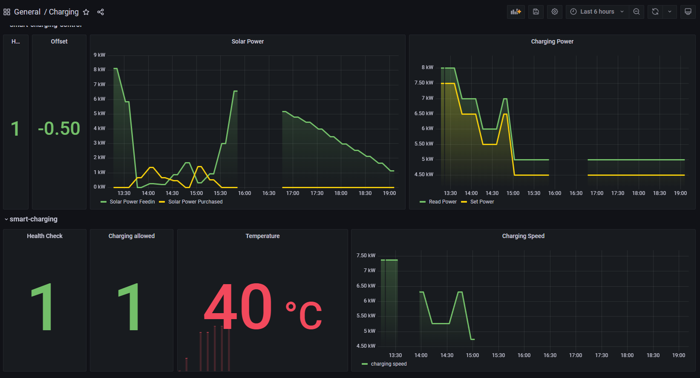

# Smart Charging

This project offers a low-level API to interact with an electric car charging station (by SCHRACK). It is meant to be run on a Raspberry-Pi, connected to the charging station via Modbus. You can request temperature data and the current charging speed and modify the maxiumum charging speed.

I use this API to charge my electric car with the exact amount of electricity currently provided by my solar panels to minimise the energy I buy and to save costs.

### Dashboard

I use my self-hosted Grafana Dashboard to monitor this service and [smart-charging-control](https://github.com/obrhubr/smart-charging-control), which is running on my homelab.

